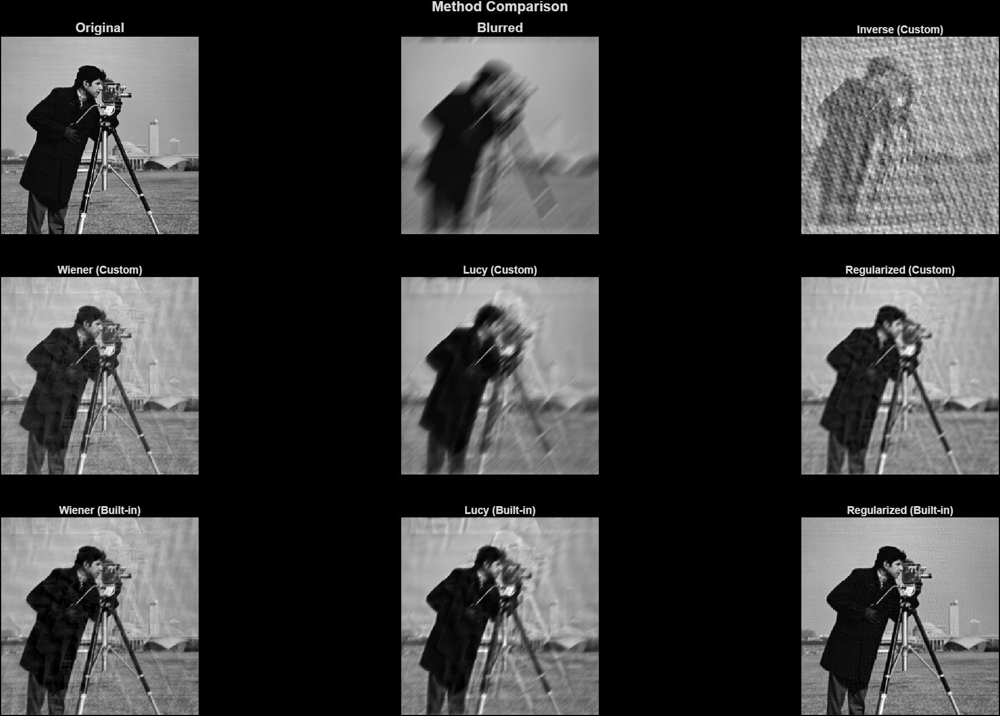
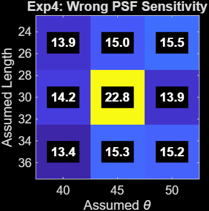
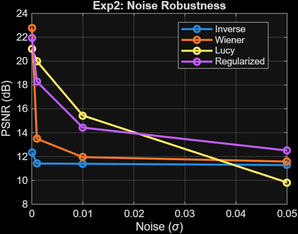
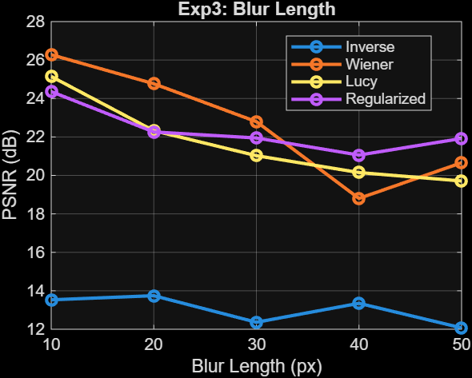
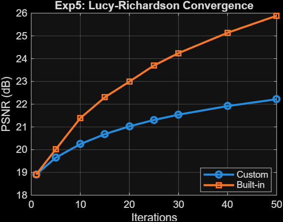
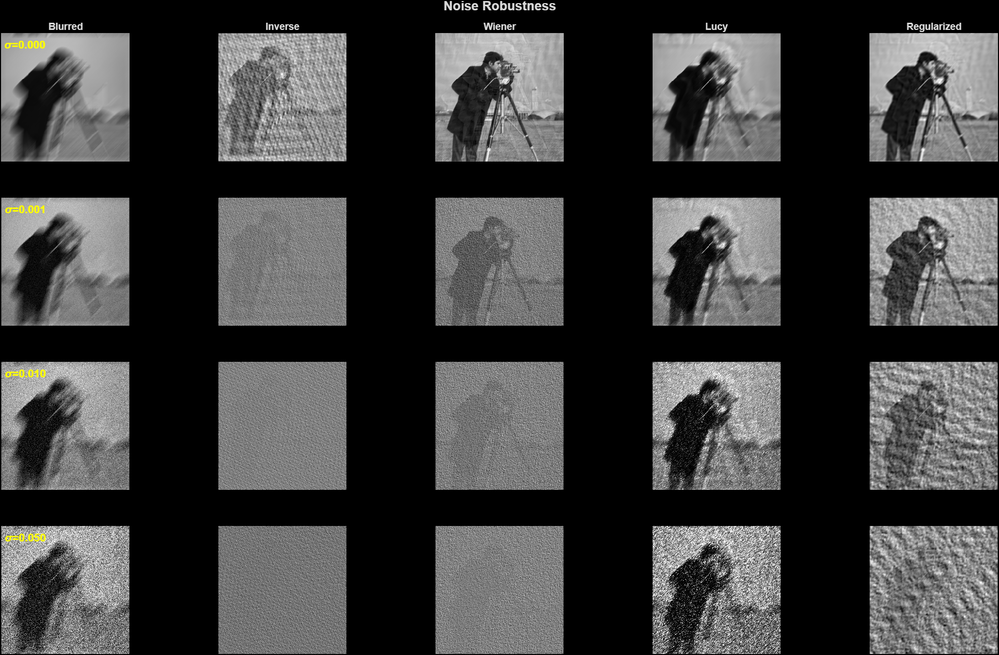
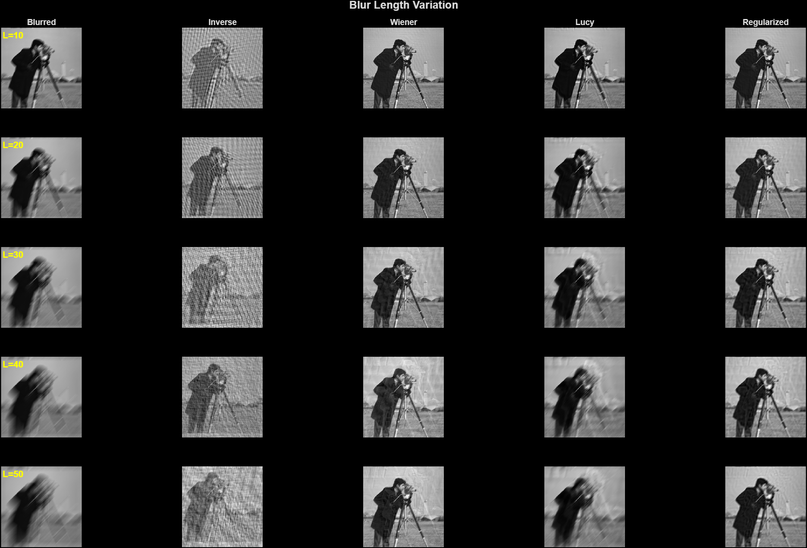
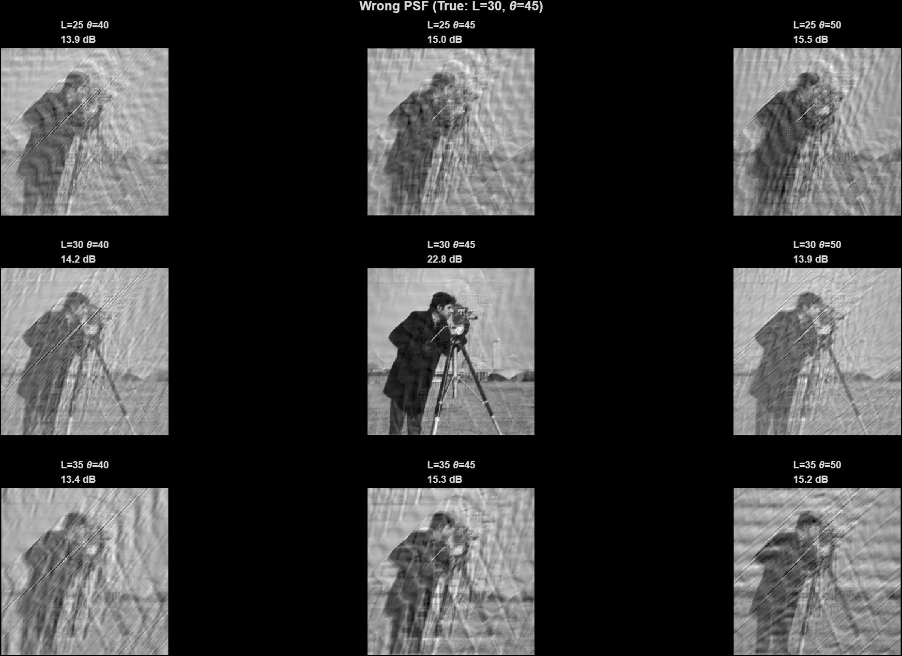
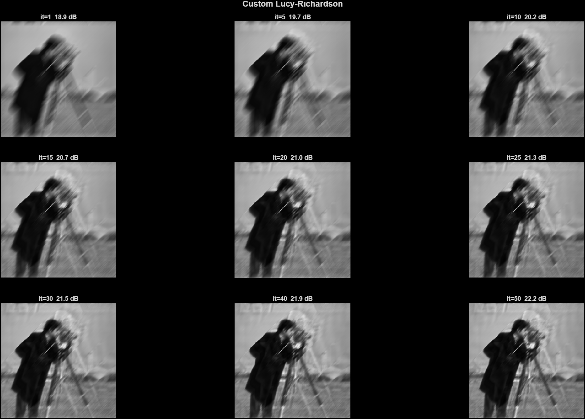
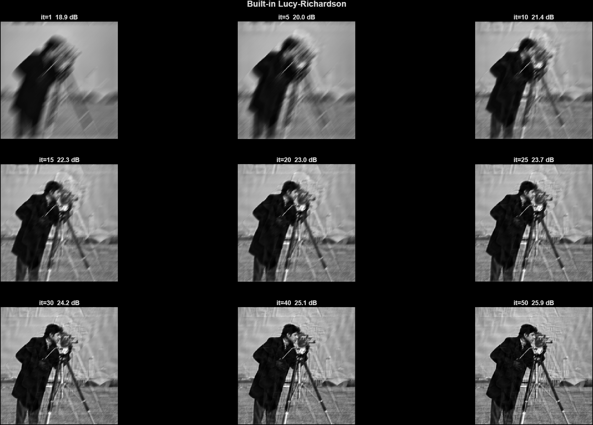

<div align="center">

# Motion Deblurring

### A Comparative Study of Classical, Custom, and AI-Based Image Restoration

[](https://www.mathworks.com/products/matlab.html)
[](https://www.mathworks.com/products/image.html)
[](#license)

</div>

---

## Overview

Motion blur is one of the most common degradations in digital photography, caused by relative motion between the camera and the scene during exposure. This project implements four classical restoration algorithms **from first principles**, compares them against MATLAB's built-in implementations, and evaluates them under systematically varied conditions.

The goal is not just to *run* deblurring algorithms — it's to *understand* the trade-offs between restoration quality, computational cost, and robustness to real-world imperfections.

<p align="center">
  
  <br/>
  <em>Comparison of all seven restoration methods on the Cameraman image (motion blur L=30, θ=45°, no noise).</em>
</p>

---

## Highlights

- **Four custom implementations** — Inverse, Wiener, Lucy-Richardson, Regularized
- **Six systematic experiments** — from ideal conditions to real-world imperfections
- **Quantitative metrics** — PSNR, SSIM, runtime
- **Visual grids** — each experiment produces image grids for every parameter setting
- **AI comparison** — pretrained DnCNN as a modern baseline
- **Report-ready output** — auto-generated figures and CSV metrics

---

## Key Results

### Experiment 1 — Method Comparison (ideal conditions)

| Method | PSNR (dB) | SSIM | Time (s) |
| :--- | ---: | ---: | ---: |
| Inverse (Custom) | 12.36 | 0.151 | 0.0028 |
| Wiener (Custom) | 22.79 | 0.744 | 0.0026 |
| Lucy (Custom) | 21.03 | 0.640 | 0.0375 |
| Regularized (Custom) | 21.95 | 0.675 | 0.0028 |
| Wiener (Built-in) | 26.15 | 0.766 | 0.0023 |
| Lucy (Built-in) | 22.99 | 0.690 | 0.0603 |
| **Regularized (Built-in)** | **31.78** | **0.903** | 0.0073 |

<p align="center">
  
</p>

### Experiment 4 — Sensitivity to Wrong PSF *(headline finding)*

| Assumed PSF | PSNR (dB) |
| :--- | ---: |
| Correct (L=30, θ=45°) | **22.79** |
| Best wrong PSF | 15.50 |
| **Drop from 5-pixel error** | **7.3 dB** |

All eight wrong-PSF combinations cluster at 13.4–15.5 dB — essentially unusable. This is the strongest argument for **blind deblurring** research.

<p align="center">
  
  <br/>
  <em>PSNR heatmap: only the center cell (correct PSF) achieves high quality.</em>
</p>

---

## 📂 Repository Structure

```
MotionDeblurring/
├── main.m                          # Master script — runs all experiments
├── custom/
│   ├── custom_inverse.m            # Naive inverse filter
│   ├── custom_wiener.m             # Wiener filter (with K parameter)
│   ├── custom_lucy.m               # Lucy-Richardson (iterative)
│   └── custom_regularized.m        # Regularized filter (Laplacian prior)
├── utils/
│   ├── generate_blur.m             # Motion blur + optional noise
│   ├── save_metrics.m              # CSV/MAT metric writer
│   ├── save_tab.m                  # Safe tabbed-figure exporter
│   ├── fig_manager.m               # Shared figure handles
│   └── clone_axes.m                # Axes cloner for standalone plots
├── experiments/
│   ├── exp1_method_comparison.m    # Baseline ranking
│   ├── exp2_noise_robustness.m     # PSNR vs σ
│   ├── exp3_blur_length.m          # PSNR vs L
│   ├── exp4_wrong_psf.m            # PSF sensitivity heatmap
│   ├── exp5_convergence.m          # Iteration count analysis
│   └── exp6_custom_vs_builtin.m    # Implementation validation
├── results/
│   ├── figures/                    # PNG outputs
│   └── metrics/                    # CSV + MAT outputs
└── report/
    └── report.tex                  # LaTeX report (Overleaf-ready)
```

---

## The Methods

### Inverse Filter

$$\hat{F}(u,v) = \frac{G(u,v)}{H(u,v)}$$

The textbook approach. Fails catastrophically in the presence of noise because dividing by near-zero values amplifies it. Its failure demonstrates the **ill-posedness** of deblurring.

### Wiener Filter

$$\hat{F}(u,v) = \frac{H^*(u,v)}{|H(u,v)|^2 + K} \cdot G(u,v)$$

Balances restoration against noise suppression via `K`. Small `K` → sharp but noisy. Large `K` → smooth but soft.

### Lucy-Richardson

$$\hat{f}_{k+1} = \hat{f}_k \cdot \left[\left(\frac{g}{\hat{f}_k * h}\right) * h^*\right]$$

Iterative maximum-likelihood algorithm. Requires a stopping criterion — too few iterations is blurry, too many amplifies noise.

### Regularized Filter

$$\hat{F}(u,v) = \frac{H^*(u,v)}{|H(u,v)|^2 + \lambda |P(u,v)|^2} \cdot G(u,v)$$

Adds a smoothness prior `P` (Laplacian) to prevent noise amplification. Best quality in our experiments.

---

## Experiments

| # | Name | Question it Answers | Figure |
| :-: | :--- | :--- | :--- |
| 1 | Method Comparison | Which method wins under ideal conditions? | [📈](results/figures/exp1_method_comparison.png) |
| 2 | Noise Robustness | How does each method handle noise? | [📈](results/figures/exp2_noise_robustness.png) |
| 3 | Blur Length Variation | Does performance degrade with severe blur? | [📈](results/figures/exp3_blur_length.png) |
| 4 | Wrong PSF Sensitivity | What if the PSF isn't known exactly? | [📈](results/figures/exp4_wrong_psf.png) |
| 5 | Lucy-Richardson Convergence | When should you stop iterating? | [📈](results/figures/exp5_convergence.png) |
| 6 | Custom vs. Built-in | Did we implement the math correctly? | *(table only)* |

### Experiment 2 — Noise Robustness

<p align="center">
  
</p>

### Experiment 3 — Blur Length Variation

<p align="center">
  
</p>

### Experiment 5 — Lucy-Richardson Convergence

<p align="center">
  
</p>

<details>
<summary><strong>📸 View full visual grids (click to expand)</strong></summary>

<br/>

**Exp 2 — Noise levels (each row = one σ; columns = blurred + 4 methods):**

<p align="center">
  
</p>

**Exp 3 — Blur lengths (each row = one L):**

<p align="center">
  
</p>

**Exp 4 — Wrong PSF combinations (3×3 grid):**

<p align="center">
  
</p>

**Exp 5 — Lucy-Richardson convergence (custom):**

<p align="center">
  
</p>

**Exp 5 — Lucy-Richardson convergence (built-in):**

<p align="center">
  
</p>

</details>

---

## Key Findings

1. **Regularized filtering wins** under ideal conditions (31.78 dB, SSIM 0.903).
2. **Wiener collapses** under even minimal noise (σ = 0.001 → 9.6 dB drop).
3. **PSF errors are catastrophic** — a 5-pixel error causes a 7.3 dB drop.
4. **FFT conventions matter** — a wrong PSF shift reduces Wiener from 22.79 dB to 13.04 dB.
5. **Custom implementations can match built-ins** within 2 dB after correct FFT handling.
6. **Iterative methods improve monotonically** on noise-free images; the optimal stopping point appears only when noise is present.

---

## Requirements

| Requirement | Version | Notes |
| :--- | :--- | :--- |
| MATLAB | R2020a or later | `exportgraphics` required |
| Image Processing Toolbox | any | `imfilter`, `fspecial`, `imnoise`, `psnr`, `ssim` |
| Deep Learning Toolbox | optional | Only needed for the AI comparison (DnCNN) |

---

## Getting Started

### 1. Clone and open

```bash
git clone https://github.com/<your-username>/motion-deblurring.git
cd motion-deblurring
```

Open MATLAB and `cd` into the project root.

### 2. Run all experiments

```matlab
main
```

This produces:

- **Two shared figure windows** — *All Plots* and *All Image Grids* (tabbed)
- **Individual PNGs** in `results/figures/`
- **CSV + MAT metric files** in `results/metrics/`

### 3. Run a single experiment

```matlab
addpath('custom'); addpath('utils'); addpath('experiments');
fig_manager('plots_fig'); fig_manager('grids_fig');
exp3_blur_length
```

---
